# RL_exercise_projects
reinforcement learning projects, RL练手项目

## project1
is_slippery=False，gamma = 0.8

环境为：

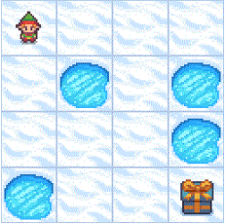
### 策略迭代
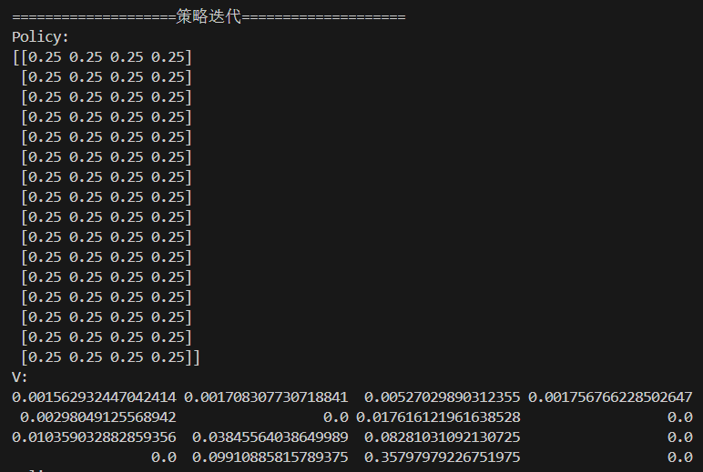
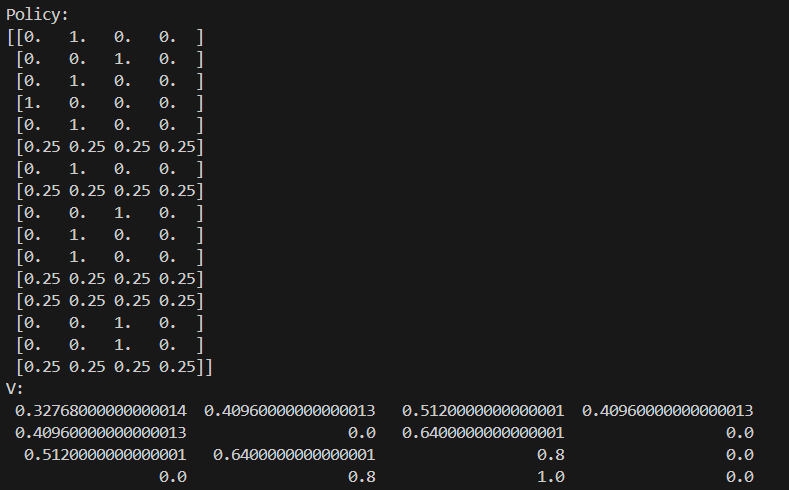
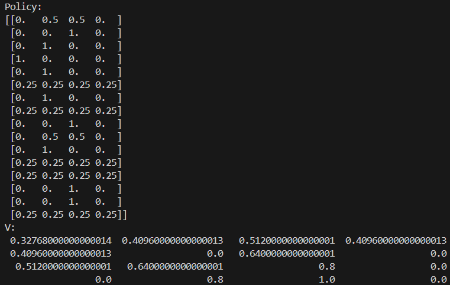
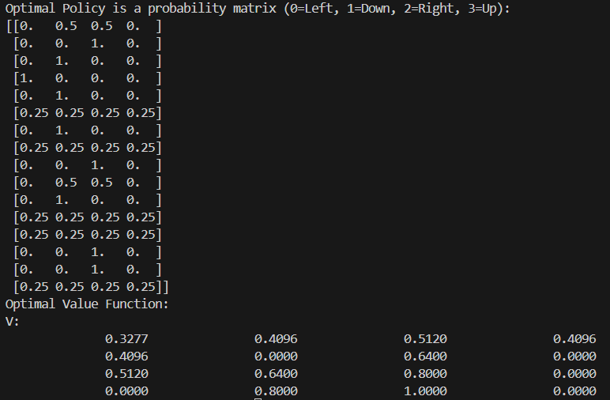

### 价值迭代

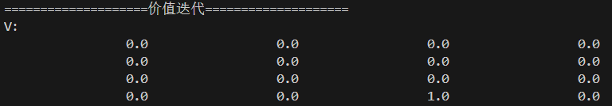
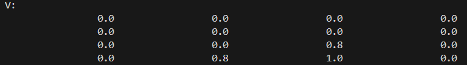
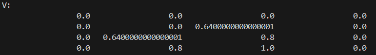
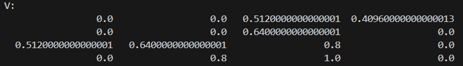
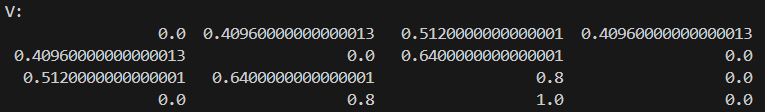
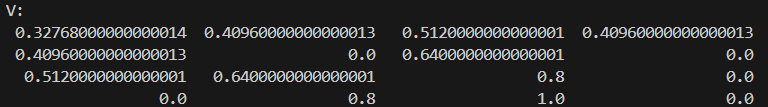
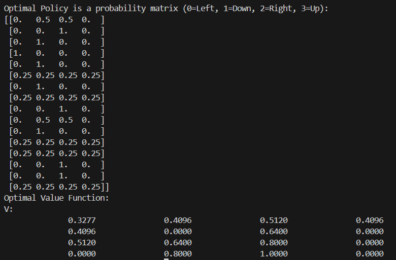

### PS：策略迭代中如果设置is_slippery=False，gamma=1，最终会收敛出两种策略如下：

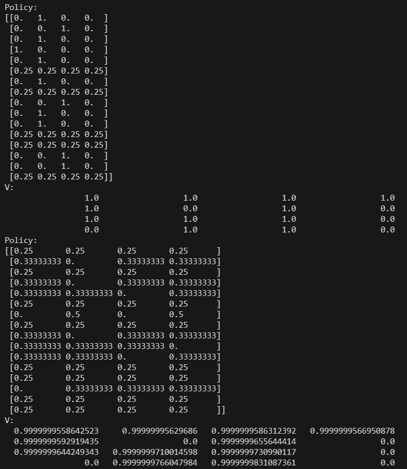

因为gamma=1，每个状态是处于平等地位的（距离终点的远近没有任何影响），所以一种策略是单向直达终点，一种策略是可以选择任何非冰湖的状态。

1. 设r=0.8则可以收敛到最优策略，使得不同状态有了差别（距离终点的远近），最终收敛到一种策略（单向直达）

2. 或者有多个最优策略不能收敛，可以建立最优策略集